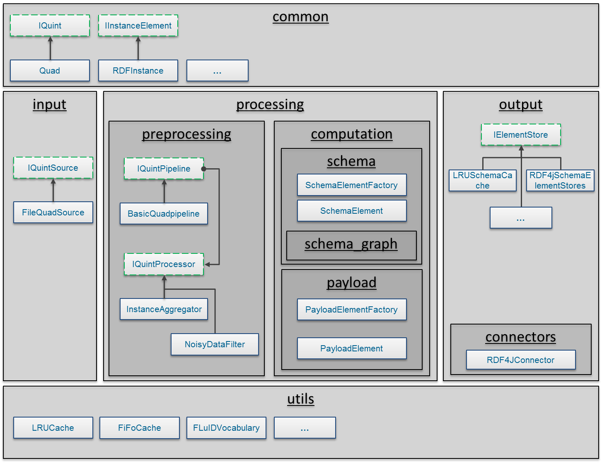

# FLuID Framework

## Disclaimer
The source code of the FLuID framework is still under active development. Some features are still missing but will be added soon. Also, the documentation is quite limited, but we are working on more examples.

## About
The Formal schema-Level Index model for the web of Data (FLuID) is a mathematical model based on equivalence relations to formulate schema-level indices [1]. In this project, we implemented the basic building blocks, i.e., the Schema Elements along with their parameterizations in a generic, modular processing pipeline. This enables users to easily configure and compute any schema-level index.
Furthermore, the framework comes with a generic FLuID query engine that is able to perform structural queries on any index modeled with FLuID.

We implemented the schema computation in a pipeline architecture following the basic principles of the SchemEX approach [2]. However, we redesigned the approach in a way that allows to abstract from the stream-based computation approach.

The figure below outlines the basic concept of the FLuID approach. All modules, e.g., the schema computation, can be changed and implemented differently.

### Set up

 - Add grammatica libray to local maven repository
 	``mvn install:install-file -Dfile=libs/grammatica-1.6.jar -DgroupId=percederberg.net -DartifactId=grammatica -Dversion=1.6 -Dpackaging=jar -DgeneratePom=true``
 - Get submodule schema-graph and add jar to local maven repository
 	+ clone fluid-schema-graph
 	+ cd into project
 	+ ``mvn package``
 	+ ``mvn install:install-file -Dfile=target/schema-graph-1.0.jar -DgroupId=kd.informatik -DartifactId=schema-graph -Dversion=1.0 -Dpackaging=jar -DgeneratePom=true``

The computation pipeline and the query engine are developed as Java 8 Maven projects. We rely on the Rdf4J triple stores interface since we reuse the RDF beans framework (https://github.com/cyberborean/rdfbeans).

#### Computation Pipeline

1. Setup a Tomcat with Rdf4J running
2. Create a repository
3. Run the FLuID framework with host and repository parameters
4. Profit!

#### Query Engine

This component can translate structural queries to the FLuID model.

### Development

Simplified component diagram:

### References

1. Blume, T., Scherp, A.: Towards flexible indices for distributed graph data: The formal schema-level index model FLuID. In: 30th GI-Workshop on Foundations of Databases (Grundlagen von Datenbanken). CEUR Workshop Proceedings (2018), http://ceur-ws.org/Vol-2126/paper3.pdf.
2. Konrath, M., Gottron, T., Staab, S., Scherp, A.: SchemEX - efficient construction of a data catalogue by stream-based indexing of Linked Data. J. Web Sem. 16, 52–58 (2012)

### Acknowledgments
This research was co-financed by the EU H2020 project [MOVING](http://www.moving-project.eu/) under contract no 693092.
